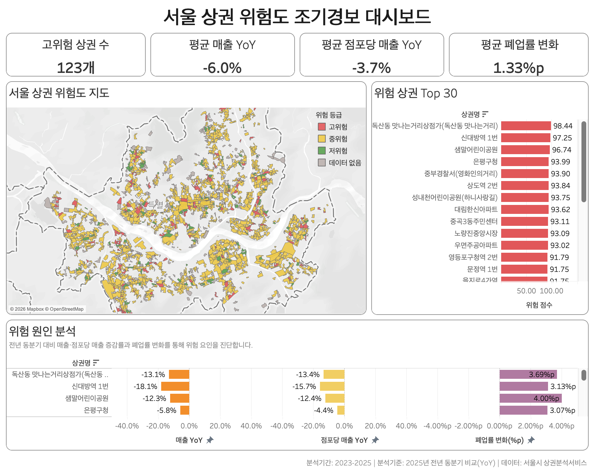
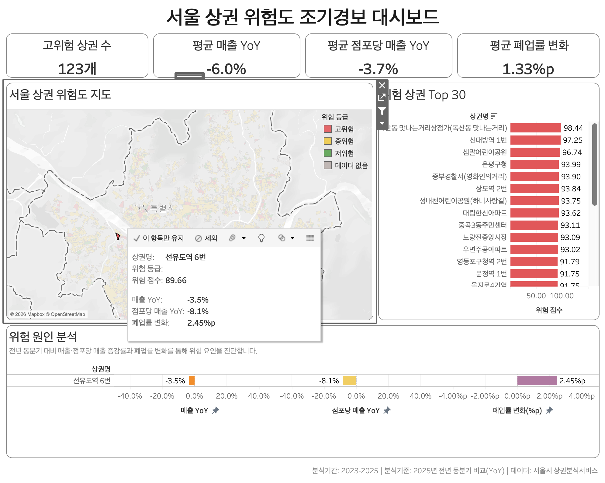

# 서울 상권 위험도 조기경보 분석

서울시 상권 매출·점포 데이터를 활용해 최근 위험 신호가 나타나는 상권을 찾고, Tableau 대시보드로 시각화한 프로젝트입니다.

## 1. 프로젝트 개요

상권을 분석할 때 현재 매출 규모만 확인하면 최근 상황이 악화되고 있는 상권을 놓칠 수 있습니다.

따라서 이 프로젝트에서는 서울시 상권분석서비스의 2023~2025년 데이터를 활용해 매출, 점포당 매출, 폐업률의 변화를 확인했습니다.

특히 전년 동일 분기와 비교한 YoY 지표를 이용해 최근 변화 방향을 파악하고, 여러 위험 신호를 종합한 Risk Score를 만들어 상권별 상대적인 위험도를 비교했습니다.

데이터 정제와 지표 계산은 PostgreSQL에서 진행했으며, 최종 결과는 Tableau 대시보드로 구성했습니다.

---

## 2. 분석 목표

- 2023~2025년 서울 상권 매출·점포 데이터 통합
- 매출과 점포 데이터의 품질 검증 및 전처리
- 전년 동분기 대비 매출 및 점포 변화 분석
- 위험 신호를 종합한 상권별 Risk Score 산출
- 고위험 상권과 주요 위험 원인 파악
- Tableau를 활용한 상권 위험도 대시보드 제작

---

## 3. 사용 데이터

데이터 출처: 서울시 상권분석서비스

분석 기간: 2023~2025년

사용 데이터:
- 상권별 추정 매출 데이터
- 상권별 점포·개업·폐업 데이터
- 서울시 상권 영역 공간 데이터

분석 단위:
- 분기
- 상권
- 서비스 업종

---

## 4. 분석 과정

### 1) 데이터 품질 검증

연도별 원천 데이터에 대해 데이터 타입, 결측치, 중복값, 이상값을 확인했습니다.

2025년 점포 데이터의 컬럼 구조가 이전 연도와 달라진 부분을 확인하고, 동일한 기준으로 통합할 수 있도록 스키마를 표준화했습니다.

### 2) 데이터 통합

2023~2025년 매출 데이터와 점포 데이터를 각각 통합했습니다.

이후 다음 세 가지 값을 기준으로 매출과 점포 데이터를 연결했습니다.

- 기준 분기
- 상권 코드
- 서비스 업종 코드

조인 이후 매칭되지 않은 데이터가 있는지 추가로 검증했습니다.

### 3) KPI 생성

상권의 변화를 확인하기 위해 다음 지표를 생성했습니다.

- 매출액
- 점포 수
- 점포당 매출
- 폐업률
- 매출 YoY
- 점포당 매출 YoY
- 폐업률 변화

계절에 따른 매출 차이의 영향을 줄이기 위해 직전 분기보다 전년 동일 분기와 비교하는 YoY 방식을 사용했습니다.

예를 들어 2025년 1분기는 2024년 1분기와 비교하는 방식입니다.

### 4) 위험 신호 탐색

다음 세 가지 방향을 주요 위험 신호로 설정했습니다.

- 매출 감소
- 점포당 매출 감소
- 폐업률 상승

한 가지 지표만 악화된 경우보다 여러 지표가 함께 악화되는 상권을 확인할 수 있도록 분석했습니다.

### 5) Risk Score 산출

매출 YoY, 점포당 매출 YoY, 폐업률 변화 등 여러 지표를 종합해 상권별 Risk Score를 구성했습니다.

Risk Score는 실제 폐업 가능성을 예측하는 확률이 아니라, 상권 간 최근 변화 정도를 비교해 우선적으로 확인할 상권을 찾기 위한 상대적 위험 지표입니다.

---

## 5. Tableau 대시보드

분석 결과를 한 화면에서 확인할 수 있도록 Tableau 대시보드를 제작했습니다.

대시보드는 다음 영역으로 구성했습니다.

- 고위험 상권 수 및 주요 KPI
- 서울 상권 위험도 지도
- 위험 상권 Top 30
- 상권별 위험 원인 분석

### 전체 대시보드



지도에서는 상권별 위험등급을 확인할 수 있고, 위험 점수가 높은 상권은 Top 30 차트에서 비교할 수 있습니다.

### 상권 선택 및 위험 원인 확인



지도에서 특정 상권을 선택하면 해당 상권의 매출 YoY, 점포당 매출 YoY, 폐업률 변화를 확인할 수 있도록 구성했습니다.

---

## 6. 주요 결과

고위험군으로 분류된 상권은 총 123개였습니다.

| 지표 | 결과 |
| --- | ---: |
| 고위험 상권 수 | 123개 |
| 평균 매출 YoY | -6.0% |
| 평균 점포당 매출 YoY | -3.7% |
| 평균 폐업률 변화 | +1.33%p |

고위험군에서는 전년 동분기 대비 매출과 점포당 매출이 감소하고 폐업률은 상승하는 흐름이 나타났습니다.

또한 현재 규모가 크거나 잘 알려진 상권이라도 최근 지표가 악화되고 있다면 위험 신호가 나타날 수 있었습니다.

따라서 상권을 판단할 때 현재 매출 규모뿐만 아니라 최근 변화 방향도 함께 살펴볼 필요가 있다고 판단했습니다.

---

## 7. 활용 방안

이 대시보드는 위험 점수가 높은 상권을 먼저 찾고, 어떤 지표가 악화되었는지 확인하는 용도로 활용할 수 있습니다.

예를 들어 다음과 같은 상황에서 보조 지표로 사용할 수 있습니다.

- 상권 변화 모니터링
- 위험 신호가 나타난 지역의 우선 점검
- 상권별 매출 및 폐업 변화 비교
- 신규 출점 전 상권 조사
- 소상공인 지원이 필요한 지역 탐색

---

## 8. 한계점

Risk Score는 실제 폐업 여부를 예측하는 모델이 아니라 여러 변화 지표를 조합해 만든 상대적 위험 지표입니다.

따라서 위험 점수가 높다고 해서 해당 상권 자체가 좋지 않다는 의미는 아닙니다. 현재 활성화된 상권이라도 최근 매출이나 점포 지표가 악화되면 높은 위험 신호가 나타날 수 있습니다.

또한 연도별 상권 공간 단위의 변화가 비교 결과에 영향을 줄 수 있으므로 연도 간 결과 해석에 주의가 필요합니다.

따라서 본 분석 결과는 출점이나 투자 여부를 단독으로 결정하기 위한 지표보다는 추가 확인이 필요한 상권을 찾는 조기경보 지표로 활용하는 것을 목적으로 합니다.

---

## 9. 사용 기술

| 구분 | 사용 기술 |
| --- | --- |
| Database | PostgreSQL |
| SQL Client | DBeaver |
| Data Analysis | SQL |
| Visualization | Tableau |
| Version Control | GitHub |

---

## 10. 분석 파일

주요 SQL 파일은 분석 순서에 따라 구성했습니다.

```text
01  데이터 타입 정리
02~07  연도별 데이터 품질 검증
08  스키마 표준화
09  점포 데이터 통합
10  매출 데이터 통합
11  매출·점포 데이터 조인
12  상권 KPI 생성
13  YoY 분석
14  탐색적 분석
15  Risk Score 생성
16  Risk Score 검증
17  Tableau용 데이터셋 생성
```

각 단계의 SQL과 주요 실행 결과 캡처를 함께 저장하여 분석 과정을 확인할 수 있도록 했습니다.

---

## 11. 프로젝트를 통해 수행한 작업

데이터 품질 검증부터 Tableau 대시보드 제작까지 전체 분석 과정을 직접 진행했습니다.

`원천 데이터 확인 → 데이터 정제 → 스키마 표준화 → 데이터 통합 → KPI 생성 → YoY 분석 → 위험도 산출 → 결과 검증 → Tableau 시각화`

단순히 차트를 만드는 것보다, 상권의 위험 신호를 어떻게 정의할지 먼저 정하고 필요한 지표를 SQL로 만든 뒤 실제로 탐색할 수 있는 대시보드까지 연결하는 데 중점을 두었습니다.

---

## 12. Tableau 대시보드

서울 상권의 위험 등급 분포와 고위험 상권 순위, 상권별 위험 요인을 한눈에 확인할 수 있도록 Tableau 대시보드를 구성했습니다.

[Tableau Public 대시보드 바로가기](https://public.tableau.com/views/____17881953785990/sheet3?:language=ko-KR&:sid=&:redirect=auth&:display_count=n&:origin=viz_share_link)
